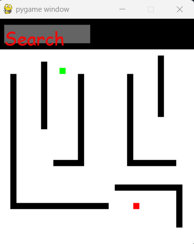
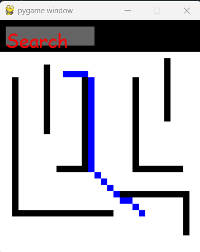

# Dijkstra Pathfinding Visualization with Pygame

A Python script that implements and visualizes Dijkstra's algorithm on a grid-based map using Pygame. This interactive demo allows users to observe how the algorithm explores nodes and finds the shortest path between a start and goal position.

## Key Features  
- Custom implementation of Dijkstra’s algorithm with diagonal movement.  
- Loads map data from a `.npy` file (`mapaProfundidad2.npy`).  
- Visualizes the grid, visited nodes, and the final shortest path.  
- Simple button interface to trigger the search.

## Requirements  
- Python 3.x  
- pygame  
- numpy

## Screenshots

